# Tugas Pendahuluan
1. Jelasin apa yang lebih baik, jaringan wired atau jaringan wireless?
2. Apa perbedaan antara router, access point, dan modem?
3. Jika kamu diminta menghubungkan dua ruangan di gedung berbeda tanpa menggunakan kabel, perangkat apa yang kamu pilih? Jelaskan alasannya.

# Modul Jaringan Wireless
## 1.1 Apa itu Jaringan Wireless?
"Wireless" secara harfiah berarti "tanpa kabel". Jadi, jaringan wireless adalah jaringan komunikasi yang tidak menggunakan kabel untuk menghubungkan antar perangkat. Sebagai gantinya, jaringan ini memanfaatkan gelombang elektromagnetik (EM waves) seperti gelombang radio atau inframerah sebagai media transmisinya.

"Kalau kabel itu seperti jalan aspal yang harus dibangun fisik, maka wireless itu seperti udara yang bisa dilewati sinyal — bebas hambatan dan lebih fleksibel!"

Kalau kabel itu seperti jalan aspal yang harus dibangun fisik, maka wireless itu seperti udara yang bisa dilewati sinyal — bebas 
hambatan dan lebih fleksibel!

### 1.1.1 Tipe-tipe Jaringan Wireless
#### 1.1.1.1 Wi-Fi
**Wi-Fi (Wireless Fidelity)** adalah teknologi standar untuk jaringan WLAN (Wireless Local Area Network) yang menghubungkan komputer dan perangkat lain tanpa kabel ke jaringan dan internet.

"Gampangnya, Wi-Fi itu seperti versi nirkabel dari kabel LAN. Kalau kabel LAN butuh ditancapkan, Wi-Fi cukup cari sinyal, klik SSID, masukin password, dan kamu sudah online!"

Wi-Fi menggunakan gelombang radio untuk mengirim dan menerima data dengan kecepatan tinggi.
Saat kamu tersambung ke Wi-Fi, sebenarnya kamu sedang terhubung ke router wireless, yang lalu menyambungkan perangkatmu ke internet.

Router Wi-Fi akan:
- Menciptakan jaringan lokal tanpa kabel
- Mengatur perangkat yang tersambung
- Mengirim data ke internet (dan sebaliknya)

#### 1.1.1.2 Bluetooth
Bluetooth adalah standar komunikasi jarak pendek (short-range wireless) yang memungkinkan perangkat seperti HP, laptop, speaker, printer, kamera, dan lainnya saling terhubung tanpa kabel.

"Kalau Wi-Fi itu jaringan untuk internet, Bluetooth itu untuk komunikasi antar perangkat jarak dekat — kayak kamu kirim lagu dari HP ke speaker bluetooth."

Bluetooth menggunakan gelombang radio 2.4 GHz (frekuensi yang sama dengan Wi-Fi) untuk mentransfer data antar perangkat.

**Kelebihan Bluetooth:**
- Tidak butuh router atau access point
- Bisa melewati benda atau tembok tipis
- Hemat daya dan biaya murah
- Umumnya plug-and-play

#### 1.1.1.3 Perbedaan Wi-Fi dan Bluetooth
| Aspek        | Wi-Fi                         | Bluetooth                      |
| ------------ | ----------------------------- | ------------------------------ |
| Tujuan utama | Akses internet                | Koneksi antar perangkat        |
| Jangkauan    | Lebih luas (hingga 100m)      | Jarak pendek (maks 10m)        |
| Kecepatan    | Lebih cepat                   | Cukup untuk file kecil/audio   |
| Daya         | Boros (lebih tinggi)          | Hemat daya                     |
| Koneksi      | Melalui router / access point | Langsung antar perangkat (P2P) |


## 1.2 Perbedaan Jaringan Wired vs Wireless
| Aspek                | Wired Network (Kabel)                 | Wireless Network (Wi-Fi)                    |
| -------------------- | ------------------------------------- | ------------------------------------------- |
| Media                | Kabel fisik (biasanya Ethernet)       | Gelombang radio / EM waves                  |
| Mobilitas            | Terbatas (harus tetap di dekat kabel) | Tinggi (bebas gerak selama dalam jangkauan) |
| Kemudahan pemasangan | Lebih ribet (perlu instalasi kabel)   | Lebih praktis (tinggal konek SSID)          |
| Kecepatan            | Sangat stabil dan tinggi              | Tergantung sinyal, bisa turun kalau jauh    |
| Keamanan             | Lebih aman secara fisik               | Perlu proteksi (WPA2/WPA3, password, dll)   |
| Cocok untuk          | Server, desktop tetap, studio editing | Laptop, HP, tablet, perangkat mobile        |
| Contoh penggunaan    | Lab komputer, kantor, data center     | Rumah, kampus, cafe, bandara, hotel         |

## 1.3 Teknologi Wireless dan Standar IEEE 802.11
Apa itu standar IEEE 802.11? Dia lebih tepatnya adalah arsitektur dari jaringan wireless LAN (WLAN), atau seperti yang kita bahas tadi ia adalah Wi-Fi.

"Ibaratnya, kalau Wi-Fi itu kendaraan, maka IEEE 802.11 adalah buku aturan lalu lintasnya."

Standar Wi-Fi terdiri dari banyak versi (amandemen), contohnya:
| Versi Standar | Keterangan                          |
| ------------- | ----------------------------------- |
| 802.11a       | Kecepatan tinggi, frekuensi 5 GHz   |
| 802.11b       | Salah satu standar awal, 2.4 GHz    |
| 802.11g       | Lebih cepat dari 802.11b            |
| 802.11n       | Dual-band, sangat populer           |
| 802.11e       | Mendukung QoS (Quality of Service)  |
| 802.11ac/ax   | Generasi baru, lebih cepat & stabil |

### 1.3.1 Station (STA)
Merupakan setiap perangkat yang terhubung ke jaringan WLAN.
Dibagi menjadi dua jenis utama:

1. Wireless Access Point (WAP / AP)
Perangkat penghubung antara jaringan kabel dan nirkabel

Berfungsi sebagai jembatan antara client dan router

2. Client
Perangkat pengguna seperti laptop, HP, printer, tablet, dll

Terhubung ke jaringan melalui SSID dari Access Point.

### 1.3.2 Access Point (AP)
Salah satu elemen utama dalam arsitektur 802.11 adalah Access Point (AP).
- **AP mendukung koneksi kabel dan wireless** secara bersamaan.
- Dalam standar 802.11, jaringan kabel yang terhubung ke AP disebut:<br>
**👉 Distribution System (DS)**
- **Fungsi utama AP adalah sebagai jembatan (bridge)** antara:
  - Jaringan wireless (Wi-Fi)
  - Jaringan kabel (Ethernet)

Jadi, AP **meneruskan data** antara perangkat wireless dan jaringan LAN, dengan memproses **frame Ethernet level 2 (L2)** dari dan ke dua sisi tersebut.

### 1.3.3 SSID: Identitas Jaringan Wireless
Setiap jaringan wireless (Wi-Fi) pasti memiliki **SSID (Service Set Identifier)**, yaitu:
- **Nama unik** yang membedakan satu jaringan WLAN dengan yang lain
- Semua perangkat yang ingin bergabung ke jaringan harus menyambung ke SSID yang sama

"Misalnya kamu lihat SSID bernama Kampus_ITS_Wifi, itu adalah identitas WLAN tempatmu akan berga bung."

## 2.1 Perangkat Wireless Network

### 2.1.1 Access Point
**Access Point (AP)** adalah perangkat jaringan yang berfungsi untuk menghubungkan perangkat wireless (nirkabel) seperti laptop, smartphone, atau tablet ke jaringan kabel, seperti LAN atau internet.

"Gampangnya, Access Point itu seperti jembatan antara dunia tanpa kabel (wireless) dan dunia dengan kabel (wired)."

Access Point akan menciptakan jaringan wireless lokal (WLAN) di area tertentu — biasanya di kantor, sekolah, gedung besar, atau ruang publik lainnya.

#### 2.1.1.1 Cara Kerja Access Point
Access Point bekerja dengan tersambung ke router, switch, atau hub melalui kabel Ethernet. Dari situ:
1. Access Point menerima koneksi jaringan kabel.
2. Kemudian memancarkan sinyal Wi-Fi ke area sekitar.
3. Perangkat seperti HP, laptop, atau tablet mendeteksi SSID dari Access Point.
4. Setelah terhubung, perangkat bisa mengakses jaringan/internet seolah-olah terhubung langsung lewat kabel.

### 2.1.2 Wireless Router
**Wireless Router** adalah perangkat jaringan yang berfungsi sebagai penghubung antara jaringan lokal (LAN) dengan jaringan luar seperti internet, sekaligus menyediakan koneksi nirkabel (Wi-Fi) untuk perangkat pengguna.

"Gampangnya, kalau router biasa itu seperti gerbang masuk ke internet lewat kabel, maka wireless router itu gerbang yang juga memancarkan Wi-Fi ke HP, laptop, dan perangkat lainnya."

#### 2.1.2.1 Fungsi Wireless Router
Fungsi Wireless Router
Wireless router menggabungkan dua peran dalam satu perangkat:

1. Router:
- Mengarahkan lalu lintas data antara jaringan lokal dan internet.
- Mengatur jalur pengiriman paket data.
- Bisa menghubungkan beberapa jaringan LAN.

2. Transmitter Wi-Fi:
- Memancarkan sinyal nirkabel ke sekitarnya agar perangkat bisa terhubung tanpa kabel.
- Mengelola komunikasi antar perangkat dalam jaringan lokal wireless.

#### 2.1.2.2 Perbedaan Router dengan Access Point

### 🔄 Perbedaan Router dengan Access Point
Walaupun keduanya sering ditemukan dalam jaringan wireless, **router** dan **access point** adalah dua perangkat yang memiliki **fungsi yang berbeda**. Banyak orang mengira keduanya sama karena sama-sama memancarkan Wi-Fi, padahal peran dan penggunaannya berbeda.

| Aspek                      | Router                                         | Access Point                                   |
|----------------------------|-----------------------------------------------|------------------------------------------------|
| Fungsi utama               | Menghubungkan jaringan lokal ke internet       | Menghubungkan perangkat wireless ke jaringan lokal |
| Apakah bisa pancarkan Wi-Fi?| Ya (jika wireless router)                     | Ya, khusus untuk jaringan lokal                 |
| Apakah butuh koneksi ke router lain? | Tidak, biasanya berdiri sendiri (terhubung ke modem) | Ya, perlu terhubung ke router/switch utama      |
| Menyediakan DHCP/IP        | Ya, biasanya memiliki DHCP server              | Bisa ya, bisa juga tidak (tergantung perangkat) |
| Cocok untuk                | Internet rumah, kantor kecil                  | Memperluas jangkauan Wi-Fi di gedung besar      |
| Topologi                   | Titik pusat jaringan                          | Perpanjangan jaringan wireless                 |
| Contoh penggunaan          | Wi-Fi utama rumah/kantor                      | Tambahan Wi-Fi di ruangan lain / lantai lain   |


### 2.1.3 Wireless Network Interface Controller (NIC)
**Wireless NIC** itu adalah komponen hardware yang bikin laptop, PC, atau perangkat lain bisa nyambung ke jaringan Wi-Fi. Bisa langsung nempel di motherboard atau berupa perangkat tambahan kayak USB dongle atau kartu PCI.

Wireless NIC, atau sering juga disebut **wireless adapter** atau **kartu Wi-Fi**, adalah alat penting biar perangkat bisa terkoneksi ke jaringan nirkabel. Alat ini memungkinkan kita terhubung ke internet tanpa kabel, dan bisa ditemukan di berbagai perangkat: laptop, desktop, HP, tablet, sampai perangkat IoT.

#### 2.1.3.1 Cara Kerja Wireless NIC
NIC nirkabel bekerja dengan cara mengubah data jadi sinyal radio, lalu dikirim lewat udara ke router atau access point. Router ini bakal ubah lagi sinyal jadi data yang bisa dimengerti oleh jaringan.

**Bagian penting dari Wireless NIC:**
- **Radio Transceiver:** Kirim dan terima sinyal radio.
- **Antena:** Bantu jangkauan sinyal lebih luas.
- **Driver & Firmware:** Software buat komunikasi antara hardware dan sistem operasi.
- **MAC Address:** Identitas unik tiap NIC di jaringan.

#### 2.1.3.2 Jenis-Jenis Wireless NIC
Wireless NIC hadir dalam berbagai bentuk tergantung kebutuhan:

- **Internal NIC:** Udah nempel di motherboard (umum di laptop).
- **PCI/PCIe NIC:** Kartu tambahan buat desktop, biasanya sinyalnya lebih kuat.
- **USB Wi-Fi Adapter:** Praktis buat PC lama, tinggal colok USB.
- **Mini PCIe & M.2 NIC:** Kecil, cocok buat laptop dan sistem embedded.
- **Wireless Dongle:** Adapter kecil untuk TV, konsol game, dll.

#### 2.1.3.3 Keunggulan Wireless NIC
Kenapa banyak orang pakai wireless NIC? Ini dia alasannya:

- **Mobilitas:** Gak perlu kabel, bebas pindah tempat.
- **Praktis:** Gampang nyambung ke jaringan.
- **Skalabilitas:** Tambah perangkat ke jaringan tanpa ribet narik kabel.
- **Fleksibel:** Bisa dipakai di banyak jenis perangkat.
- **Lebih Murah:** Gak perlu biaya instalasi kabel jaringan.

#### 2.1.3.4 Fitur Keren Wireless NIC
Beberapa fitur bikin wireless NIC makin keren:

- **Multiple Antennas (MIMO):** Bikin sinyal makin kuat.
- **Dual-Band (2.4 & 5 GHz):** Lebih fleksibel, gangguan lebih sedikit.
- **Keamanan Tinggi:** Dukungan WPA2, WPA3, dll.
- **Dukungan Wi-Fi Terbaru:** Misal Wi-Fi 6 untuk kecepatan dan efisiensi lebih baik.
- **Driver Update:** Produsen biasanya kasih update buat performa dan kompatibilitas.

### 2.1.4 Repeater / Range Extender
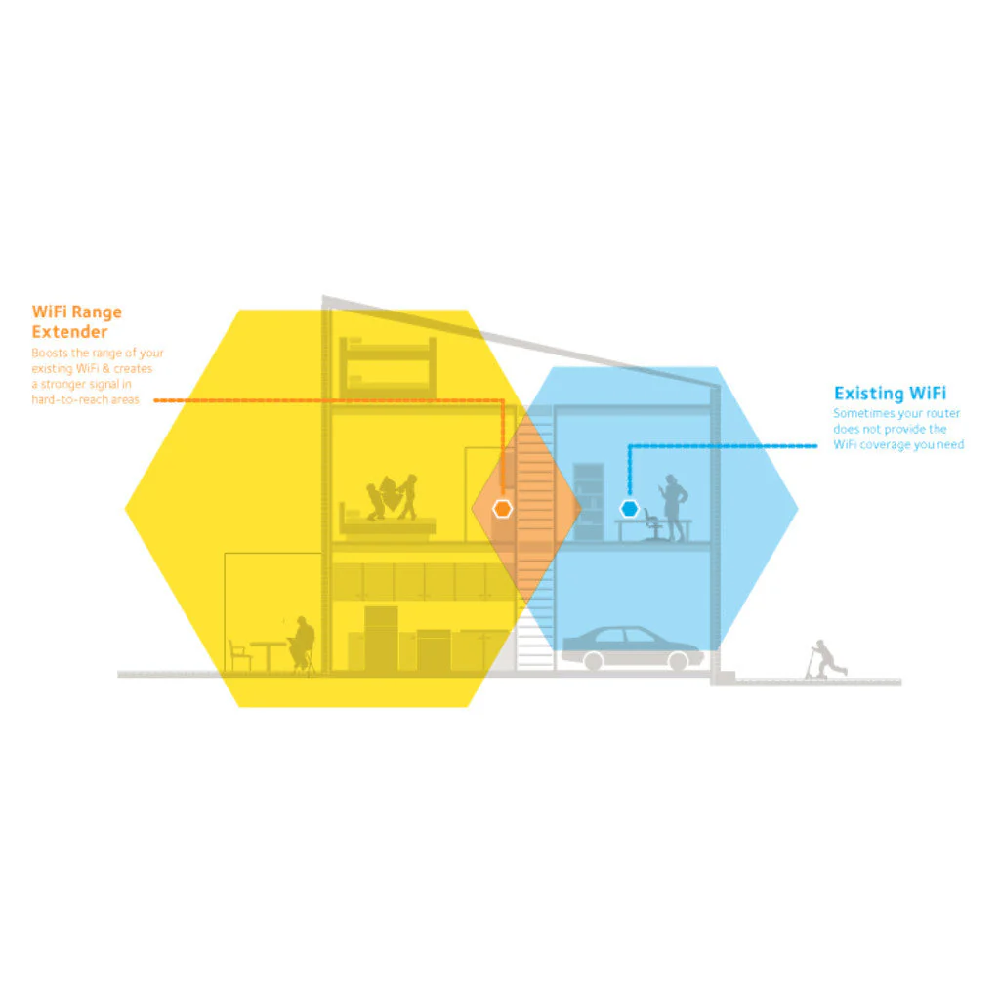
**WiFi Repeater** atau **WiFi Extender** itu alat buat memperluas jangkauan sinyal WiFi di rumah atau kantor. Cara kerjanya simpel: alat ini menangkap sinyal WiFi yang udah ada, terus diperkuat dan dipancarkan ulang ke area yang sinyalnya lemah. Dengan repeater ini, kamu bisa nyambung WiFi sampai ke pojok rumah, lantai atas, atau bahkan halaman belakang.

WiFi repeater itu isinya dua router mini. Yang satu tugasnya nangkep sinyal WiFi dari router utama, dan yang satu lagi nyebarin ulang sinyal yang udah diperkuat tadi.

Semua repeater **pasti ada penurunan kecepatan**. Yang parah itu biasanya **single-band repeater** karena mereka pakai frekuensi yang sama buat nerima dan nyebar sinyal — ini bisa bikin bandwidth turun sampai 50%.

**Dual-band repeater** lebih bagus karena bisa nerima sinyal dari router di satu frekuensi dan ngeluarin sinyal baru di frekuensi lain. Misalnya, **Netgear Nighthawk AC1900** pakai teknologi **FastLane**, punya prosesor 1GHz dual-core buat performa maksimal.

### 2.1.5 Wireless Bridge
**Wireless Bridge** adalah perangkat yang berfungsi untuk **menghubungkan jaringan utama (router/internet)** ke **perangkat lain di lokasi berbeda** secara **nirkabel (tanpa kabel)**, khususnya untuk **jarak jauh dan tetap**.

> Ibarat jembatan digital, Wireless Bridge mengantarkan jaringan internet dari satu tempat ke tempat lain — biasanya di area yang tidak terjangkau sinyal Wi-Fi biasa.

Contoh Kasus:
> Kamu punya rumah utama dengan router, dan ada **guest house** atau kantor kecil di jarak 1 kilometer.  
Kamu bisa pasang Wireless Bridge di kedua titik, sehingga guest house tetap mendapatkan koneksi internet dari rumah utama.

#### 2.1.5.1 Cara Kerja Wireless Bridge

- Router utama terhubung ke modem seperti biasa.
- Wireless Bridge dipasang di router utama dan diarahkan ke lokasi kedua.
- Wireless Bridge lainnya dipasang di lokasi kedua, **menerima sinyal dan meneruskannya ke perangkat lokal (PC, switch, dll).**

Jadi Wireless Bridge bertugas **mengirim sinyal internet dari satu titik ke titik lain secara fokus**, seperti jembatan sempit yang menghubungkan dua pulau.

#### 2.1.5.2 Perbedaan Wireless Bridge vs Router

| Aspek                     | Wireless Router                                   | Wireless Bridge                                      |
|--------------------------|----------------------------------------------------|------------------------------------------------------|
| Fungsi utama             | Menghubungkan LAN ke internet                     | Memperluas cakupan jaringan secara arah tertentu     |
| Radius Sinyal            | 360 derajat                                       | Fokus satu arah (point-to-point atau point-to-multipoint) |
| Perlu modem?             | Ya (biasanya terhubung ke modem ISP)              | Tidak. Hanya butuh jaringan dari router              |
| Contoh penggunaan        | Wi-Fi rumah, kantor, cafe                         | Antar gedung, guest house, tower komunikasi          |


#### 2.1.5.1 AirGrid M5 HP
**AirGrid M5 HP** adalah perangkat **wireless outdoor** buatan **Ubiquiti Networks** yang digunakan untuk **menghubungkan jaringan antar lokasi yang berjauhan** tanpa kabel — umumnya antar gedung, menara, atau area terpencil.

Perangkat ini masuk kategori **Wireless Bridge** tipe **Point-to-Point (PtP)** karena mengarahkan sinyal internet dari satu titik ke titik lain secara fokus, bukan menyebarkannya ke segala arah seperti router biasa.

> Ibaratnya, AirGrid M5 adalah **jembatan internet nirkabel** antar lokasi yang terpisah secara fisik.

##### 2.1.5.1.1 Spesifikasi Umum AirGrid M5 HP

| Fitur                      | Keterangan                                     |
|----------------------------|-----------------------------------------------|
| **Frekuensi**              | 5 GHz (karena itu namanya "M5")               |
| **Jarak Jangkauan**        | Hingga **10+ km** dalam kondisi ideal         |
| **Jenis Antena**           | Grid (parabola kawat) dengan sinyal terarah   |
| **Mode Operasi**           | Station / Access Point / Bridge               |
| **Kecepatan Transfer**     | Hingga **100 Mbps** (tergantung kondisi)      |
| **Koneksi**                | 1 port Ethernet + **PoE** (Power over Ethernet)|
| **Tahan Cuaca**            | Ya, dirancang untuk penggunaan luar ruangan   |

##### 2.1.5.1.2 Cara Kerja AirGrid M5 HP

1. **Perangkat 1 (Tx)**: Terhubung ke jaringan/internet utama (misalnya router di gedung A)
2. **Perangkat 2 (Rx)**: Dipasang di lokasi tujuan (misalnya gedung B)
3. Keduanya saling diarahkan secara **line of sight** (tanpa halangan)
4. Sinyal dikirim dan diterima dalam bentuk **jaringan LAN**, bisa langsung ke switch atau router lokal

##### 2.1.5.1.3 PoE (Power over Ethernet)
AirGrid M5 menggunakan **PoE**, artinya:
- Cukup **satu kabel LAN** untuk menghantarkan **data dan daya (listrik)**
- Tidak perlu stop kontak di atap/tower — hanya butuh kabel ke perangkat PoE injector di dalam ruangan


## 3.1 Keamanan Jaringan Wireless


Keamanan jaringan nirkabel bikin lapisan perlindungan dengan kombinasi dari:

- Enkripsi: Nyamarkan data supaya cuma bisa dibaca yang punya kunci.
- Autentikasi: Pastikan perangkat dan orang yang nyambung itu valid.
- Kontrol akses: Atur siapa bisa akses apa.
- Keamanan perangkat: Identifikasi perangkat yang aman dan set aturan di sistem keamanan lainnya.
- Deteksi intrusi: Pantau jaringan dan blokir aktivitas mencurigakan secara real-time.

Semua itu untuk cegah akses ilegal dan jaga keamanan jaringan. Prosesnya dimulai dari enkripsi kayak WPA2 atau WPA3 yang nyamarkan data biar nggak bisa dibaca orang lain.

Saat ada perangkat yang mau nyambung, sistem bakal minta verifikasi identitas, biasanya lewat password. Lalu, kontrol akses bakal nentuin siapa yang boleh masuk dan sampai sejauh mana aksesnya.

Setelah itu, keamanan perangkat dijaga dengan antivirus, update sistem, dan pembatasan akses admin. Sistem IDPS juga aktif buat ngawasin jaringan dari aktivitas mencurigakan.

### 3.1.1 Jenis-Jenis Protokol Keamanan Wi-Fi
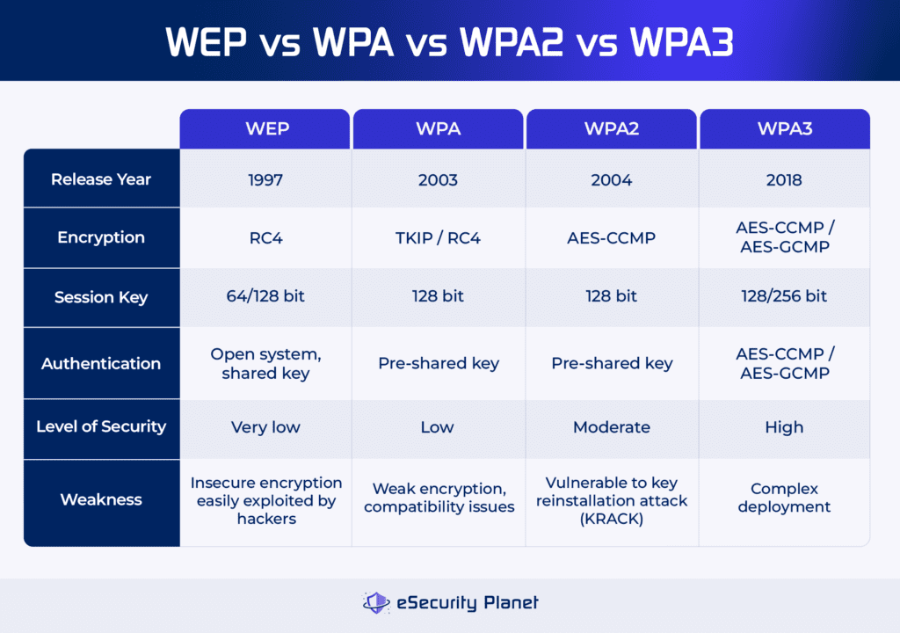

1. WEP (Wired Equivalent Privacy)
- Protokol lama (1997)
- Gampang dibobol karena pakai RC4 yang lemah
- Sekarang udah nggak direkomendasikan

2. WPA (Wi-Fi Protected Access)

- Pengganti WEP, muncul tahun 2003
- Pakai TKIP
- Ada dua mode: WPA-Personal dan WPA-Enterprise
- Lebih baik dari WEP, tapi masih kurang aman dibanding WPA2

3. WPA2
- Rilis 2004
- Pakai AES encryption, jauh lebih aman
- Jadi standar umum
- Masih punya celah seperti KRACK

4. WPA3
- Protokol terbaru (2018)
- Lebih aman, anti brute force, dan konfigurasi lebih gampang
- Ada tiga versi: WPA3-Personal, WPA3-Enterprise, dan Enhanced Open
- Masih belum banyak dipakai karena masalah kompatibilitas dan adopsi lambat

5 Cara Jaga Keamanan Wi-Fi

### 3.1.2 Cara Jaga Keamanan Wi-Fi
 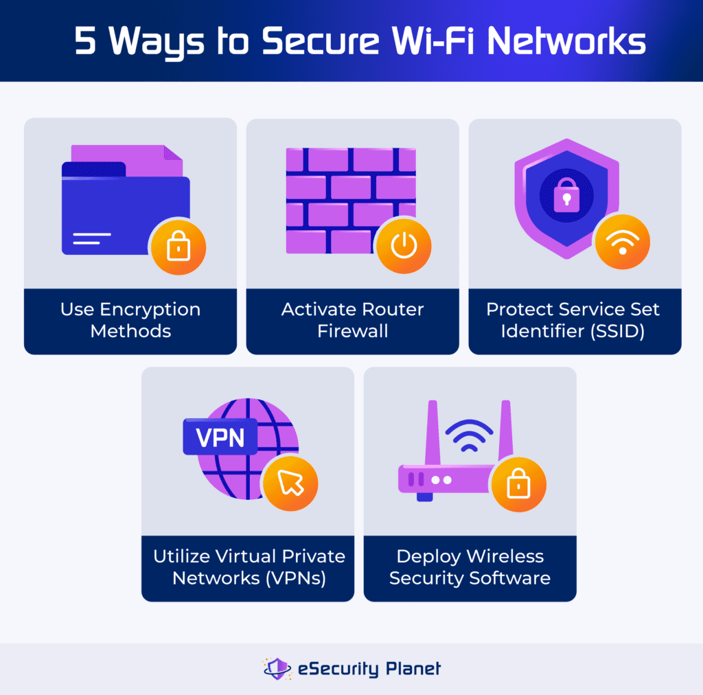

1. Gunakan Enkripsi
Pakai WPA2 atau WPA3 biar data kamu nggak gampang disadap.

2. Aktifkan Firewall Router
Cek pengaturan router dan aktifkan firewall buat perlindungan ekstra.

3. Amankan SSID
Hindari pakai nama yang gampang ditebak (kayak nama kamu). Bikin unik dan nggak mencolok.

4. Pakai VPN
VPN bantu enkripsi koneksi kamu, apalagi di Wi-Fi publik. Cari yang pakai AES-256.

5. Gunakan Aplikasi Keamanan Wi-Fi
Aplikasi kayak Wireshark, NetSpot, dll. bisa bantu cek performa, cari celah, dan pantau aktivitas mencurigakan.

### 3.1.3 Jenis Autentikasi Wireless
1. Multi-Factor Authentication (MFA)
Gabungan password + verifikasi tambahan (misal OTP, biometrik).

2. Single Sign-On (SSO)
Login sekali untuk akses beberapa aplikasi.

3. Password-Based
Pakai username dan password. Umum, tapi rentan kalau gak dijaga.

4. Passwordless
Tanpa password! Pakai biometrik atau one-time link. Lebih aman dan praktis.

# TAHAPAN PRAKTIKUM


## Wireless Point to Point


Konfigurasi Router
1. Reset Router Jika masih ada konfigurasi 
Pastikan router telah di-reset ke kondisi awal (tanpa konfigurasi) agar konfigurasi yang kita lakukan bersih dan tidak terjadi konflik, Untuk reset bisa gunakan winbox masuk menu system->reset konfigurasi-> cek list no default konfigurasi
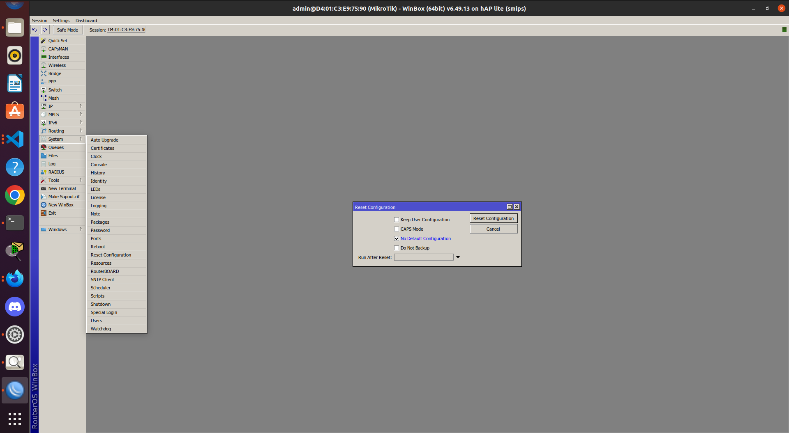
2. Login ke Router
Gunakan Winbox untuk mengakses router melalui MAC address atau IP default. Login menggunakan user admin (tanpa password jika belum diatur).

3. Aktifkan Interface Wireless Wlan 1
Masuk pada Menu Wireless-> Wifi Interface -> Klik interface Wlan 1 dan tekan tanda panah warna biru untuk enable
Konfigurasikan untuk Router A Sebagai ( setelah double Klik pada interface wlan 1 masuk ke tab Wireless ) :
- Mode : Bridge
- SSID : PointToPoint_No kelompok
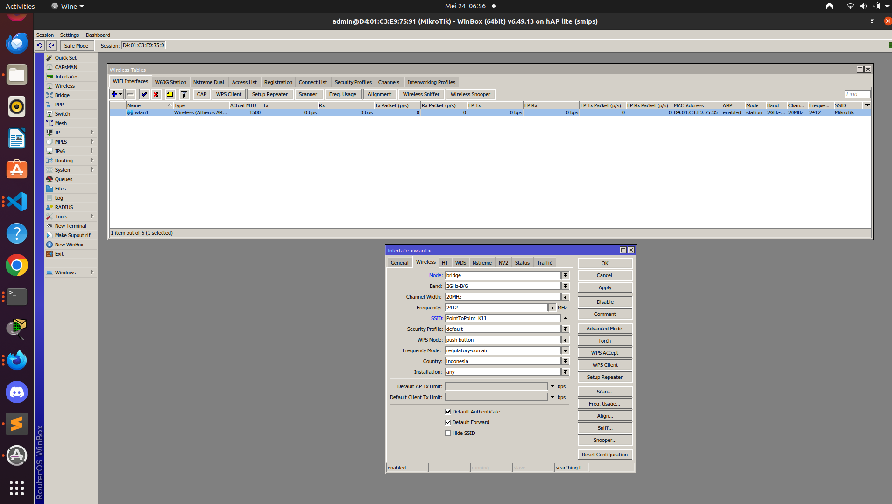

Konfigurasikan untuk Router B Sebagai ( setelah double Klik pada interface wlan 1 masuk ke tab Wireless ) : 
- Mode : Station
- Setelah itu klik tombol scan dan pilih interface menjadi wlan 1 lalu akan muncul berbagai jaringan wifi cari nama wifi yang sesuai dengan Router A lalu klik Connect.

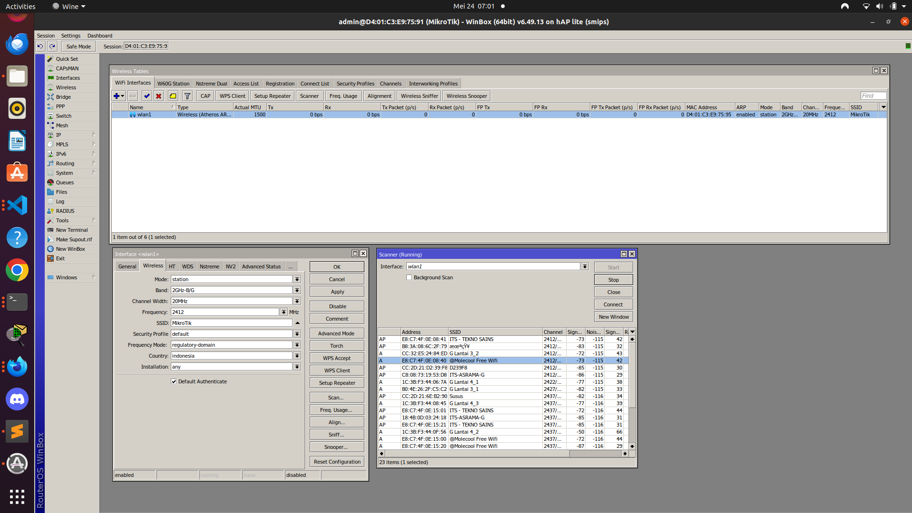

4. Konfigurasi IP Address pada Wlan 1 
Tambahkan IP address pada Wlan 1 yang digunakan sebagai jalur antar-router. Karena hanya ada dua perangkat yang terhubung (router A dan router B),
- IP Wlan 1 Router A  : 10.10.10.1/29
- IP Wlan 1 Router B : 10.10.10.2/29
5. Konfigurasi IP Address untuk Jaringan LAN (note lakukan konfigurasi ini pada router A dan b)
Tambahkan IP address pada ether 2 yang digunakan untuk menghubungkan Laptop dengan Router. <br>
- IP ether 2 Router A  : 192.168.20.1/24
- IP ether 2 Router B  : 192.168.30.1/24

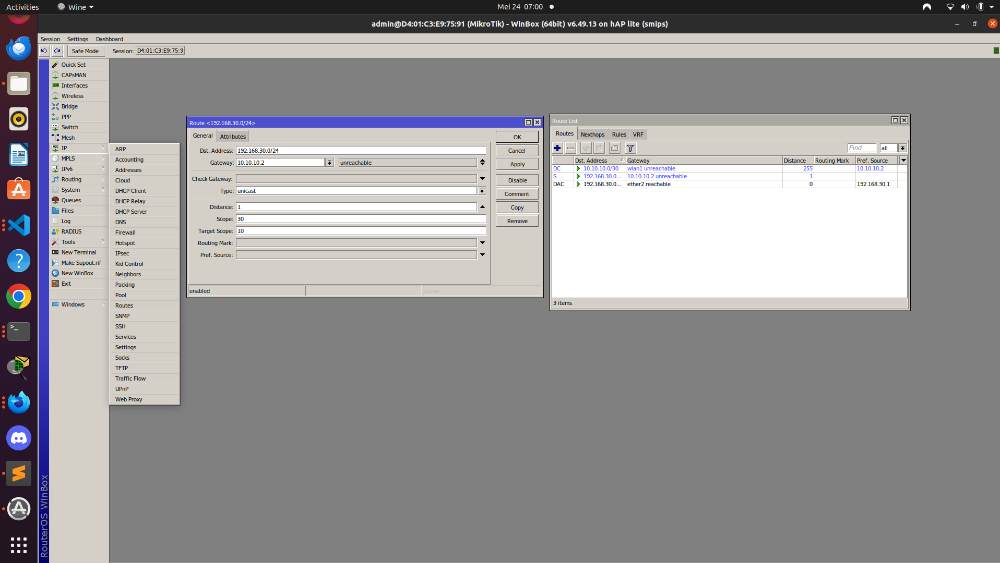


6. Konfigurasi Routing Statis (note lakukan konfigurasi ini pada router A dan b)
Setelah semua interface diberi IP, langkah selanjutnya adalah menambahkan rute secara manual.
Masuk ke menu IPv4 → Routes, kemudian klik "+" untuk menambahkan routing.
Pada Router A
- Dst. Address: 192.168.30.0/24
- Gateway: 10.10.10.2
Pada Router B
- Dst. Address: 192.168.20.0/24
- Gateway: 10.10.10.1


7. Test Koneksi Antar Router
- Dari Router A, buka New Terminal, ping Wlan 1 Router B:
```bash
ping 10.10.10.2
```
- Dari Router B, ping Wlan 1 Router A:
```bash
ping 10.10.10.1
```
8. Konfigurasi IP Adress di Laptop (note lakukan konfigurasi ini laptop yang terhubung pada router A dan b masing-masing)
Karena ini masih menggunakan konfigurasi Static IP tambahkan IP address secara manual ke interface di laptop masing-masing bisa lewat Control Panel atau langsung di settings Windows, pastikan IP dan Gateway sudah benar sesuai Ether 2.
Pada laptop yang terhubung ke Router A
- IP Address : 192.168.20.2
- Gateway    : 192.168.20.1  (Router A)
- DNS        : 8.8.8.8
Pada laptop yang terhubung ke Router B
- IP Address: 192.168.30.2
- Gateway   : 192.168.30.1 (Router B)
- DNS       : 8.8.8.8

9. Jika Sudah Uji test PING dari Laptop 1 ke alamat Laptop 2, Jika berhasil maka Routing tidak ada masalah.

Pada konfigurasikan Router B dan laptop yang terhubung ke Router B lakukan hal yang sama


## Wireless Point to Multipoint


Konfigurasi Router
1. Reset Router Jika masih ada konfigurasi 
Pastikan router telah di-reset ke kondisi awal (tanpa konfigurasi) agar konfigurasi yang kita lakukan bersih dan tidak terjadi konflik, Untuk reset bisa gunakan winbox masuk menu system->reset konfigurasi-> cek list no default konfigurasi

2. Login ke Router
Gunakan Winbox untuk mengakses router melalui MAC address atau IP default. Login menggunakan user admin (tanpa password jika belum diatur).

3. Aktifkan Interface Wireless Wlan 1
Masuk pada Menu Wireless-> Wifi Interface -> Klik interface Wlan 1 dan tekan tanda panah warna biru untuk enable
Konfigurasikan untuk Router A Sebagai ( setelah double Klik pada interface wlan 1 masuk ke tab Wireless ) :
- Mode : Ap bridge
- SSID : PointToMultipoint_No kelompok
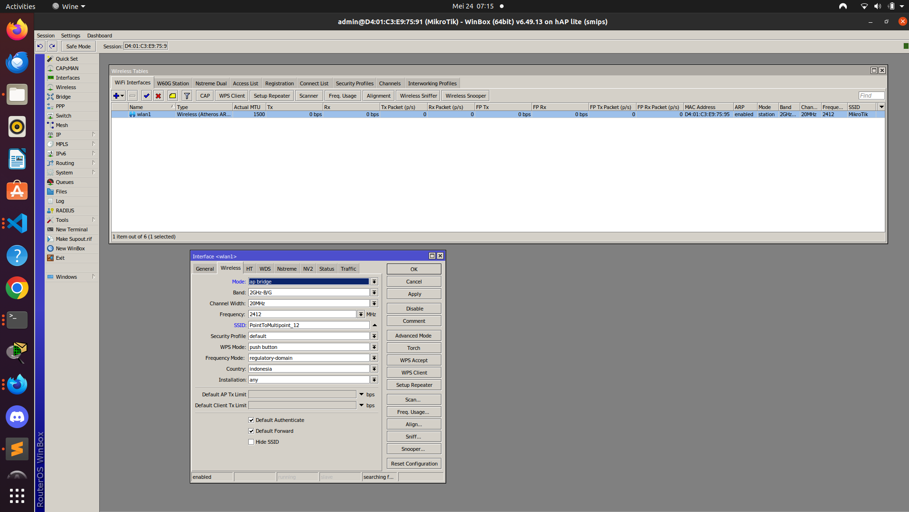

Konfigurasikan untuk Router B Sebagai ( setelah double Klik pada interface wlan 1 masuk ke tab Wireless ) : 
- Mode : Station Bridge
- Setelah itu klik tombol scan dan pilih interface menjadi wlan 1 lalu akan muncul berbagai jaringan wifi cari nama wifi yang sesuai dengan Router A lalu klik Connect.


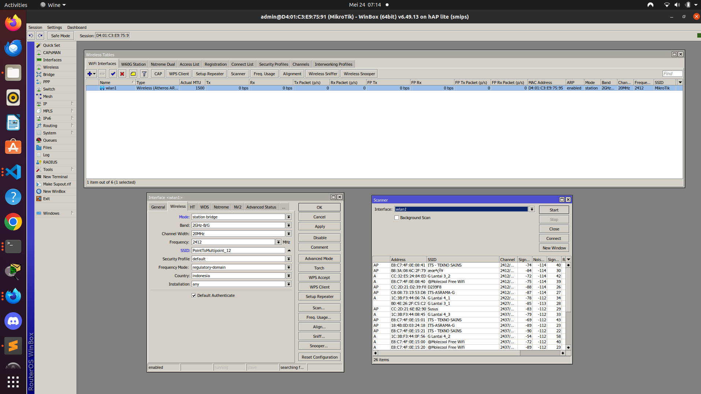
4. Konfigurasi IP Address pada Wlan 1 
Tambahkan IP address pada Wlan 1 yang digunakan sebagai jalur antar-router. Karena hanya ada dua perangkat yang terhubung (router A dan router B),
<br>
- IP Wlan 1 Router A  : 10.10.10.1/29
- IP Wlan 1 Router B : 10.10.10.2/29
5. Konfigurasi IP Address untuk Jaringan LAN (note lakukan konfigurasi ini pada router A dan b)
Tambahkan IP address pada ether 2 yang digunakan untuk menghubungkan Laptop dengan Router. <br>
- IP ether 2 Router A  : 192.168.20.1/24
- IP ether 2 Router B  : 192.168.30.1/24


6. Konfigurasi Routing Statis (note lakukan konfigurasi ini pada router A dan b)
Setelah semua interface diberi IP, langkah selanjutnya adalah menambahkan rute secara manual.
Masuk ke menu IPv4 → Routes, kemudian klik "+" untuk menambahkan routing.
Pada Router A
- Dst. Address: 192.168.30.0/24
- Gateway: 10.10.10.2
Pada Router B
- Dst. Address: 192.168.20.0/24
- Gateway: 10.10.10.1


7. Test Koneksi Antar Router
- Dari Router A, buka New Terminal, ping Wlan 1 Router B:
```bash
ping 10.10.10.2
```
- Dari Router B, ping Wlan 1 Router A:
```bash
ping 10.10.10.1
```
8. Konfigurasi IP Adress di Laptop (note lakukan konfigurasi ini laptop yang terhubung pada router A dan b masing-masing)
Karena ini masih menggunakan konfigurasi Static IP tambahkan IP address secara manual ke interface di laptop masing-masing bisa lewat Control Panel atau langsung di settings Windows, pastikan IP dan Gateway sudah benar sesuai Ether 2.
Pada laptop yang terhubung ke Router A
- IP Address : 192.168.20.2
- Gateway    : 192.168.20.1  (Router A)
- DNS        : 8.8.8.8
Pada laptop yang terhubung ke Router B
- IP Address: 192.168.30.2
- Gateway   : 192.168.30.1 (Router B)
- DNS       : 8.8.8.8

9. Jika Sudah Uji test PING dari Laptop 1 ke alamat Laptop 2, Jika berhasil maka Routing tidak ada masalah.

Pada konfigurasikan Router B dan laptop yang terhubung ke Router B lakukan hal yang sama

## Wireless Bridge

Konfigurasi Router
1. Reset Router Jika masih ada konfigurasi 
Pastikan router telah di-reset ke kondisi awal (tanpa konfigurasi) agar konfigurasi yang kita lakukan bersih dan tidak terjadi konflik, Untuk reset bisa gunakan winbox masuk menu system->reset konfigurasi-> cek list no default konfigurasi

2. Login ke Router
Gunakan Winbox untuk mengakses router melalui MAC address atau IP default. Login menggunakan user admin (tanpa password jika belum diatur).

3. Aktifkan Interface Wireless Wlan 1
Masuk pada Menu Wireless-> Wifi Interface -> Klik interface Wlan 1 dan tekan tanda panah warna biru untuk enable
Konfigurasikan untuk Router A Sebagai ( setelah double Klik pada interface wlan 1 masuk ke tab Wireless ) :
- Mode : Bridge
- SSID : WirelessBridge_No kelompok

Konfigurasikan untuk Router B Sebagai ( setelah double Klik pada interface wlan 1 masuk ke tab Wireless ) : 
- Mode : Station Pseudobridge
- Setelah itu klik tombol scan dan pilih interface menjadi wlan 1 lalu akan muncul berbagai jaringan wifi cari nama wifi yang sesuai dengan Router A lalu klik Connect.

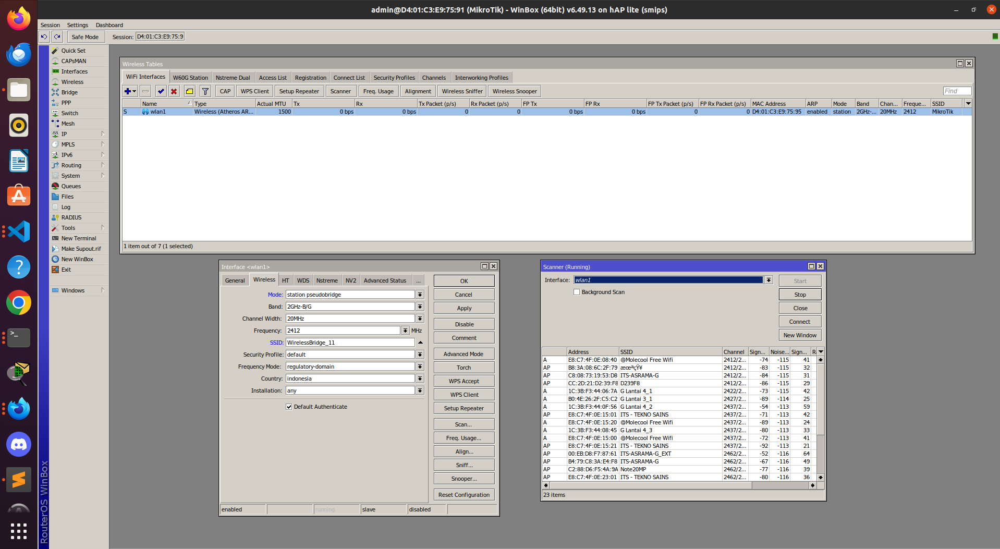

4. Konfigurasi IP Address pada Wlan 1 
Tambahkan IP address pada Wlan 1 yang digunakan sebagai jalur antar-router. Karena hanya ada dua perangkat yang terhubung (router A dan router B),
<br>
- IP Wlan 1 Router A  : 10.10.10.1/29
- IP Wlan 1 Router B : 10.10.10.2/29

5. Konfigurasi IP Address untuk Jaringan LAN (note lakukan konfigurasi ini pada router A dan b)
Tambahkan IP address pada ether 2 yang digunakan untuk menghubungkan Laptop dengan Router. <br>
- IP ether 2 Router A  : 192.168.10.2/24
- IP ether 2 Router B  : 192.168.10.3/24

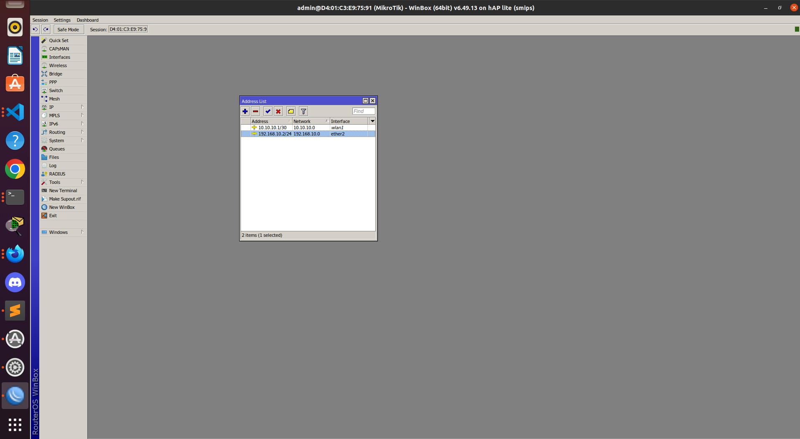
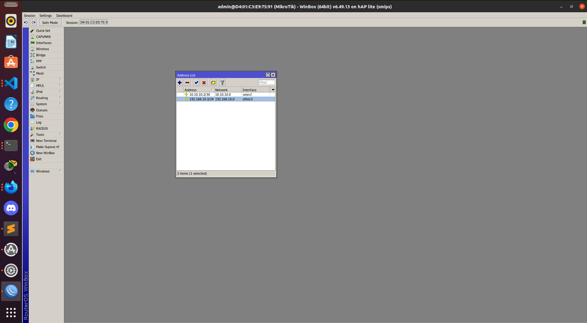

6. Tambahkan bridge pada Router A dan B untuk menghubungkan wlan 1 dan ether 2 
Router A :
- Masuk ke menu Bridge -> lalu tambah kan bridge dengan menekan tombol "+", lalu tambahkan untuk nama gunakan bridge1(atau yang lain)
- lalu masuk ke tab Port dan tambahkan :
- Interface Wlan 1 dan Ether 2 lalu gunakan bridge yang sudah di buat.
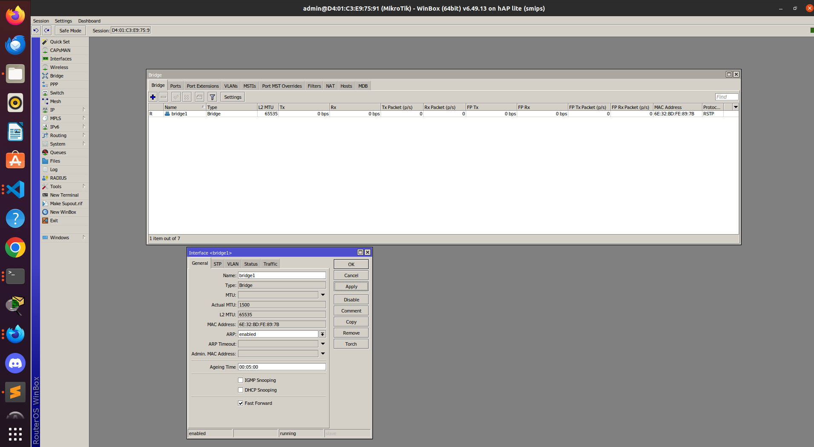

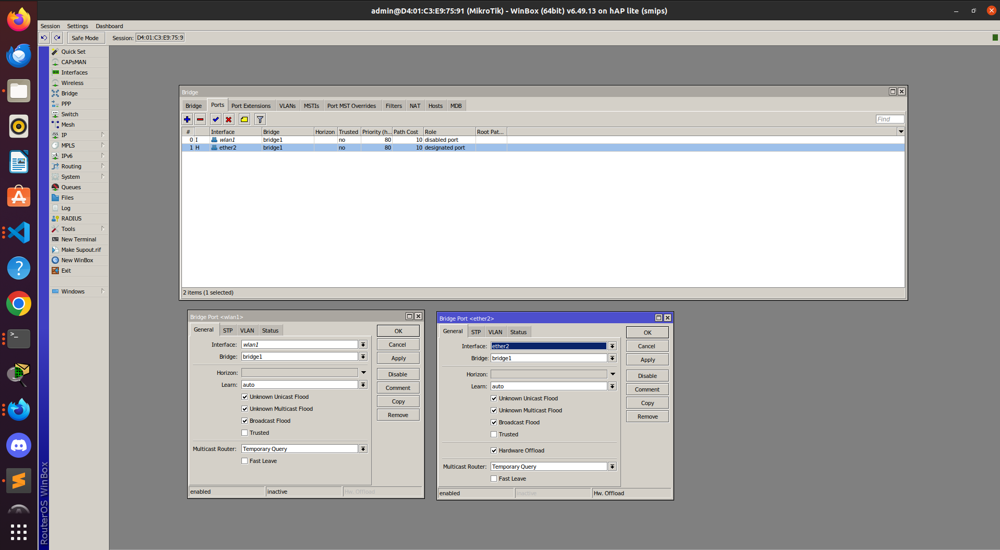

7. Test Koneksi Antar Router
- Dari Router A, buka New Terminal, ping Wlan 1 Router B:
```bash
ping 10.10.10.2
```
- Dari Router B, ping Wlan 1 Router A:
```bash
ping 10.10.10.1
```
8. Konfigurasi IP Adress di Laptop (note lakukan konfigurasi ini laptop yang terhubung pada router A dan b masing-masing)
Karena ini masih menggunakan konfigurasi Static IP tambahkan IP address secara manual ke interface di laptop masing-masing bisa lewat Control Panel atau langsung di settings Windows, pastikan IP dan Gateway sudah benar sesuai Ether 2.
Pada laptop yang terhubung ke Router A
- IP Address : 192.168.10.5
- Gateway    : 192.168.10.2  (Router A)
- DNS        : 8.8.8.8
Pada laptop yang terhubung ke Router B
- IP Address: 192.168.10.7
- Gateway   : 192.168.10.3 (Router B)
- DNS       : 8.8.8.8

9. Jika Sudah Uji test PING dari Laptop 1 ke alamat Laptop 2, Jika berhasil maka Routing tidak ada masalah.

Pada konfigurasikan Router B dan laptop yang terhubung ke Router B lakukan hal yang sama


## Wireless Point To Point Ubiqotus

# TUGAS MODUL
