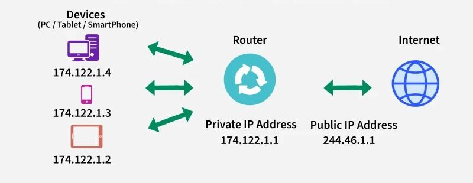

# Tugas Pendahuluan
1. Jika kamu ingin mengakses web server lokal (IP: 192.168.1.10, port 80) dari jaringan luar, konfigurasi NAT apa yang perlu kamu buat?
2. Menurutmu, mana yang lebih penting diterapkan terlebih dahulu di jaringan: NAT atau Firewall? Jelaskan alasanmu.
3. Apa dampak negatif jika router tidak diberi filter firewall sama sekali?

**Berikan referensi dari jawaban yang kamu berikan**

# Modul Firewall & NAT
## 1.1 Apa itu Firewall?
Coba bayangin firewall itu kayak satpam digital buat jaringan komputer kamu. Dia yang berdiri di gerbang jaringan buat ngecek siapa yang boleh masuk atau keluar. Jadi, kalau ada data yang mau masuk atau keluar, firewall bakal lihat dulu aturannya: boleh lewat, ditolak sambil ngasih pesan error, atau langsung diabaikan kayak nggak pernah ada. Intinya, firewall ini bantu jagain komputer dari hal-hal yang nggak diinginkan kayak hacker atau virus.

Sebelum ada firewall, keamanan jaringan cuma pakai Access Control List (ACL), tapi ACL ini nggak bisa bedain isi dari data yang lewat. Jadinya, masih banyak celah yang bisa dimanfaatin sama orang jahat. Apalagi sekarang internet udah kayak kebutuhan pokok organisasi. Sayangnya, koneksi ke internet juga buka celah buat serangan dari luar. Nah, firewall hadir buat nutup celah itu dan jagain jaringan internal biar tetap aman.

### 1.1.1 Jenis-Jenis Firewall
1. Packet Filtering
<d>
Cek satu per satu data yang lewat berdasarkan IP, port, dan protokol. Tapi dia nggak tahu ini bagian dari komunikasi yang mana, jadi agak kaku.

2. Stateful Inspection
<d>
Lebih canggih, bisa tahu ini data udah bagian dari koneksi yang sah atau belum.

3. Application Layer Firewall<d>
Bisa ngintip sampai ke isi aplikasi (kayak HTTP, FTP), bahkan bisa blokir konten tertentu. Biasanya pakai proxy.

4. Next Generation Firewall (NGFW)
<d>
Ini firewall zaman now! Bisa cek isi data lebih dalam (deep packet inspection), termasuk enkripsi SSL.

5. Circuit Level Gateway<d>
Kerja di level koneksi (session). Cuma lihat apakah koneksi udah sah atau belum, tapi nggak cek isi datanya. Jadi bisa lolos tuh malware.

6. Software Firewall
<d>
Dipasang di komputer atau server. Fleksibel tapi kadang berat dan makan waktu buat setting-nya.

7. Hardware Firewall
<d>
Bentuknya kayak perangkat fisik. Dipasang di antara internet dan jaringan internal, jadi bisa tahan serangan sebelum masuk lebih jauh.

8. Cloud Firewall<d>
Firewall yang dijalankan di cloud. Cocok buat organisasi yang udah banyak pakai layanan cloud.

### 1.1.2 Cara Kerja Firewall
Firewall punya semacam buku aturan. Tiap data yang mau masuk atau keluar dicek dulu, sesuai atau nggak sama aturan itu. Misalnya, ada aturan yang bilang pegawai HRD nggak boleh akses server programmer—nah firewall bakal blokir tuh akses. Aturan bisa beda-beda tergantung kebutuhan dan kebijakan tiap organisasi.

**Kebijakan Akses di Firewall**
1. Accept: Dia yang memberikan izin lalu lintas data untuk bisa lewat
2. Reject: Memblokir lalu lintas tapi memberikan balasan berupa *unreachable error* atau error yang tidak dapat dijangkau
3. Drop: Memblokir lalu lintas tanpa memberikan balasan sama sekali

## 1.2 Apa itu Network Address Translation (NAT)?

Pernah bingung kenapa semua orang bisa internetan padahal IP publik di dunia ini terbatas? Nah, di sinilah NAT jadi penyelamat. NAT itu semacam trik pintar yang bikin banyak perangkat di rumah atau kantor kamu bisa akses internet pakai satu IP publik aja. Jadi meskipun cuma punya satu “alamat rumah” di dunia maya, banyak “penghuni” tetap bisa kirim dan terima data.

Coba bayangin: alamat IPv4 yang tersedia cuma sekitar 4,3 miliar. Padahal perangkat yang nyambung ke internet udah lebih dari itu. Kalau tiap perangkat butuh satu IP publik, alamat bakal cepat habis. Nah, dengan NAT, cukup satu IP publik buat satu jaringan lokal, terus semua perangkat di jaringan itu bisa internetan bareng lewat IP publik yang sama.

### 1.2.1 Jenis-Jenis NAT
1. Static NAT<d>
Satu IP lokal dihubungkan ke satu IP publik (one-to-one). Jarang dipakai karena mahal dan boros IP publik. Cocok buat server yang butuh alamat tetap, misalnya buat hosting website.

2. Dynamic NAT<d>
IP lokal diubah ke IP publik dari kumpulan (pool) IP yang tersedia. Kalau IP di pool habis, permintaan koneksi ditolak. Tetap butuh banyak IP publik.

3. Port Address Translation (PAT)<d>
Ini yang paling sering dipakai. Banyak IP lokal bisa pakai satu IP publik dengan membedakan tiap koneksi berdasarkan port. Hemat dan efisien!

### 1.2.2 Cara Kerja NAT
Biasanya, NAT ini ada di router yang jadi penghubung antara jaringan lokal dan internet. Kalau ada perangkat di dalam jaringan lokal kirim data ke internet, alamat IP-nya bakal diubah jadi alamat IP publik dulu sama router. Pas data dari internet mau balik ke perangkat tadi, NAT akan ganti lagi alamat publik itu jadi IP lokal si pengirim. Semuanya dicatat rapi di "tabel NAT" biar nggak bingung.

Bayangin dua orang dari satu rumah (misalnya laptop A dan B) buka website yang sama di waktu yang sama, pakai port yang sama. Kalau cuma IP yang diubah, pas server balikin datanya, router bingung: data ini buat A atau B? Makanya, NAT juga ngubah nomor port, jadi bisa bedain mana data buat siapa.

### 1.2.3 Istilah Penting di NAT
<d>
1. Inside Local Address: IP lokal perangkat di jaringan dalam (biasanya IP privat kayak 192.168.x.x)

2. Inside Global Address: IP publik yang mewakili perangkat dari dalam jaringan ke dunia luar

3. Outside Local Address: IP tujuan dari sisi luar yang udah diterjemahin di dalam jaringan

4. Outside Global Address: IP asli dari tujuan di luar jaringan

## 1.3 Apa itu Connection Tracking?
**Connection Tracking** (pelacakan koneksi) adalah fitur **"pengamat lalu lintas jaringan"** yang cerdas. Ia mencatat siapa yang sedang ngobrol dengan siapa, kapan mulai ngobrol, lewat jalur mana (IP & port), dan apakah obrolan itu masih aktif atau sudah selesai.

Bayangkan kamu punya **resepsionis jaringan** yang mencatat semua "pengunjung" (paket data) yang masuk dan keluar. Kalau ada pengunjung yang balik lagi (paket balasan), resepsionis akan mengenalinya dan langsung mengizinkannya masuk, **tanpa perlu tanya-tanya lagi**.

Connection Tracking ini melakukan **manajemen trafik** dengan cara menyimpan informasi penting dari koneksi tersebut seperti:

- Source Address
- Destination Address
- Source Port
- Destination Port
- Protocol
- Connection State

Label ini sangat penting terutama untuk proses **firewall filtering** dan **NAT** karena memungkinkan router **mengenali status dari setiap paket data** yang lewat.

### 1.3.1 Cara Kerja Connection Tracking
Saat kamu **mengakses website**:
1. Komputer kamu mengirim permintaan ke server (misalnya IP 8.8.8.8).
2. Connection tracking mencatat: "Oke, koneksi baru dari 192.168.1.10 ke 8.8.8.8:80"
3. Server membalas → sistem tahu ini **balasan sah** dan langsung diizinkan.
4. Kalau ada koneksi aneh dari luar yang belum pernah dicatat → **langsung ditolak** (state: `invalid`)

### 1.3.2 Manfaat Connection Tracking
Connection Tracking memberikan banyak keuntungan dalam pengelolaan dan pengamanan jaringan. Berikut beberapa manfaat utamanya:
1. Keamanan yang Lebih Baik (Stateful Firewall)
2. Mendukung NAT Secara Efisien
3. Mengurangi Beban Router
4. Kontrol Lebih Detail terhadap Lalu Lintas Jaringan
5. Mendeteksi dan Menghentikan Koneksi Tidak Sah

## Tahapan Praktikum

Konfigurasi Router

1. Reset Router

Pastikan perangkat router telah dikembalikan ke konfigurasi awal untuk mencegah potensi konflik dalam pengaturan selanjutnya.

    Akses router menggunakan aplikasi Winbox.
    Navigasikan ke menu System > Reset Configuration.
    Aktifkan opsi "No Default Configuration" dengan mencentangnya.
    Klik "Reset Configuration" untuk memulai proses reset.

2. Login ke Router

Lakukan proses login untuk mengakses antarmuka router.

    Gunakan Winbox untuk melakukan koneksi ke router.
    Login dapat dilakukan melalui MAC address atau IP default perangkat.
    Gunakan username "admin". (Kata sandi tidak diperlukan jika belum diatur).

3. Konfigurasi DHCP Client pada Router A (Ether 1)

Sambungkan kabel internet ke ether1 pada Router A, kemudian lakukan konfigurasi DHCP Client.

    Akses menu IP > DHCP Client.
    Klik ikon "+" untuk menambah entri baru.
    Pilih "ether1" sebagai Interface.
    Klik "Apply" dan pastikan status koneksi menunjukkan "bound".

4. Penambahan Alamat IP pada Ether 7

Tambahkan alamat IP pada ether7 untuk konektivitas dengan Switch.

    Navigasikan ke menu IP > Addresses.
    Klik ikon "+" untuk menambahkan alamat IP.
    Masukkan Address: 192.168.10.1/24.
    Pilih Interface: "ether7".
    Klik "Apply" kemudian "OK".

5. Konfigurasi DHCP Server pada Router MikroTik

Konfigurasi DHCP Server untuk secara otomatis mendistribusikan alamat IP kepada perangkat klien yang terhubung.

    Akses menu IP > DHCP Server.
    Klik tombol "DHCP Setup".
    Pada jendela "DHCP Server Interface":
        Pilih interface yang akan mendistribusikan IP address ke klien. Contoh: "ether7" (sesuai koneksi ke Switch/Client). Klik "Next".
    Pada jendela "DHCP Address Space":
        Verifikasi network address yang akan digunakan (contoh: 192.168.10.0/24). Klik "Next".
    Pada jendela "Gateway for DHCP Network":
        Verifikasi gateway yang akan diberikan kepada klien (contoh: 192.168.10.1). Klik "Next".
    Pada jendela "Addresses to Give Out":
        Tentukan rentang alamat IP yang akan didistribusikan (contoh: 192.168.10.2-192.168.10.254). Klik "Next".
    Pada jendela "DNS Servers":
        Masukkan alamat DNS Server yang akan diberikan kepada klien (contoh: 8.8.8.8 dan 8.8.4.4). Klik "Next". (DNS akan Otomatis dapat)
    Pada jendela "Lease Time":
        Atur durasi waktu lease IP address (contoh: 00:10:00 untuk 10 menit). Klik "Next".
    Setelah semua langkah selesai, akan muncul pesan "Setup has completed successfully". Klik "OK".

6. Konfigurasi NAT

Lakukan konfigurasi NAT (Network Address Translation) untuk menyediakan konektivitas internet.

    Akses menu IP > Firewall > NAT.
    Klik ikon "+" untuk membuat aturan baru.
    Pada tab "General", atur Chain: "src-nat".
    Pada tab "Action", atur Action: "masquerade".
    Klik "Apply" kemudian "OK".

    Untuk test buka Terminal pada winbox dan test ping ke "ping 8.8.8.8" pastikan reply.

7. Konfigurasi Firewall

Tambahkan aturan filter (Filter Rules) pada firewall.

    Akses menu IP > Firewall > Filter Rule.
    Klik ikon "+" untuk menambahkan aturan baru.

Untuk Pemblokiran ICMP (Internet Control Message Protocol):

    Pada tab "General", atur Chain: "forward".
    Pada tab "General", atur Protocol: "icmp".
    Pada tab "General", atur In. Interface: "ether7".
    Pada tab "Action", atur Action: "drop".

Untuk Pemblokiran Akses Situs Web Berdasarkan Konten (Content Blocking):

    Pada tab "General", atur Chain: "forward".
    Pada tab "General", atur Protocol: "tcp".
    Pada tab "General", atur Dst. Port: "80,443".
    Pada tab "General", atur In. Interface: "ether7".
    Pada tab "General", atur Out. Interface: "ether1".
    Pada tab "Advanced", atur Content: "speedtest".
    Pada tab "Action", atur Action: "drop".

8. Konfigurasi Bridge pada Router B

Lakukan konfigurasi bridge untuk mengubah fungsi Router B menjadi hub.

    Akses menu Bridge.
    Klik ikon "+" untuk membuat bridge baru.
    Klik "Apply" kemudian "OK".

Selanjutnya, tambahkan port ke dalam bridge yang telah dibuat:

    Akses menu Bridge > Port.
    Klik ikon "+" untuk menambahkan port.
    Pilih interface yang terhubung ke perangkat laptop.
    Pilih interface yang terhubung ke Router A.

9. Konfigurasi Alamat IP pada Laptop

Pastikan pengaturan alamat IP pada laptop diatur secara otomatis melalui DHCP, lalu verifikasi perolehan alamat IP.

    Pada pengaturan sistem operasi laptop Anda (melalui Settings atau Control Panel), pastikan konfigurasi jaringan diatur ke DHCP (Automatic).
    Buka Command Prompt (CMD).
    Gunakan perintah ipconfig untuk memeriksa dan mengonfirmasi alamat IP yang telah diterima oleh laptop Anda.

10. Uji Coba Konfigurasi

Lakukan pengujian terhadap konfigurasi yang telah diterapkan untuk memverifikasi fungsionalitasnya.

Pengujian Konektivitas (ICMP):

    Buka Terminal pada laptop Anda.
    Lakukan perintah ping 8.8.8.8.
    Saat firewall aktif, respon yang diharapkan adalah Request Timed Out (RTO).
    Nonaktifkan firewall ICMP dengan menekan tanda "X" (disable) pada aturan terkait di Filter Rules.
    Ulangi perintah ping 8.8.8.8. Koneksi seharusnya berhasil (terhubung).

Pengujian Pemblokiran Konten (Browse):

    Coba akses situs web yang mengandung kata kunci "speedtest" (misalnya, www.speedtest.net) melalui peramban web Anda.
    Saat firewall konten aktif, situs web seharusnya tidak dapat diakses atau terus memuat tanpa menampilkan konten, menandakan bahwa firewall telah berhasil bekerja.
    Nonaktifkan firewall konten dengan menekan tanda "X" (disable) pada aturan terkait di Filter Rules.
    Coba akses kembali situs web tersebut. Anda seharusnya dapat mengakses situs web tersebut dengan normal.

## Tugas Modul
