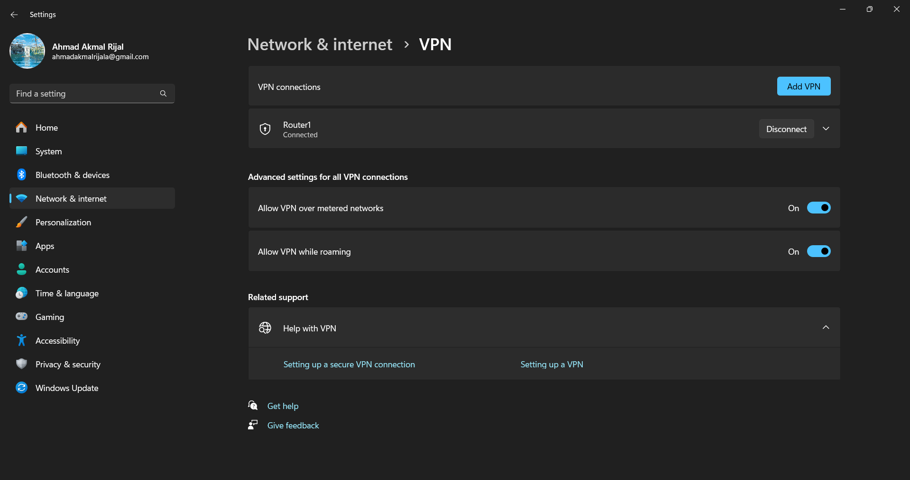

# Tugas Pendahuluan
1. Diberikan studi kasus untuk konfigurasi VPN IPSec. Suatu erusahaan ingin membuat koneksi aman antara kantor pusat dan cabang. Jelaskan secara detail:
- Fase negosiasi IPSec (IKE Phase 1 dan Phase 2)
- Parameter keamanan yang harus disepakati (algoritma enkripsi, metode autentikasi, lifetime key)
- Konfigurasi sederhana pada sisi router untuk memulai koneksi IPSec site-to-site

2. Sebuah sekolah memiliki bandwidth internet 100 Mbps yang dibagi menjadi:
- 40 Mbps untuk e-learning
- 30 Mbps untuk guru & staf (akses email, cloud storage)
- 20 Mbps untuk siswa (browsing umum)
- 10 Mbps untuk CCTV & update sistem

Buatlah skema Queue Tree yang lengkap:
- Parent dan child queue
- Penjelasan marking
- Prioritas dan limit rate pada masing-masing queue

**Dari tiap jawaban yang kalian berikan wajib memberikan referensi**

# Pengenalan Modul
## 1 Tunneling
Bayangin kamu mau kirim paket dari rumah A ke rumah B, tapi jalan di antara mereka beda-beda jenis: dari jalan aspal, terus masuk ke terowongan, terus ke jalan tanah. Nah, tunneling itu kayak ngelewatin “terowongan digital” biar data dari satu jaringan bisa nyambung ke jaringan lain yang beda jenis.

Contohnya gini: dua komputer pakai jaringan Ethernet, tapi mereka harus lewat WAN (jaringan luas) dulu buat bisa saling ngobrol. Nah, data dari si komputer A bakal “dibungkus” (disebut encapsulation) biar bisa lewat WAN, terus dibuka lagi pas udah sampai ke komputer B.


### 1.1 Cara Kerja Tunneling
1. Komputer A bikin paket data ke komputer B.
2. Paket ini dimasukin ke dalam bingkai Ethernet dan dikirim ke router M1.
3. Di router M1, data dibungkus lagi pake format WAN, dan dikirim ke router M2.
4. Di router M2, bungkus WAN dibuka, dan data dikirim ke komputer B dalam bentuk asli.

Proses bungkus-membungkus data ini yang disebut **encapsulation**. Jadi satu paket masuk ke dalam paket lain kayak boneka matryoshka.


### 1.2 Jenis-Jenis Protokol Tunneling
1. **GRE (Generic Routing Encapsulation)**<br>
Bungkus IP packet dengan header tambahan dan ngirim lewat “terowongan”. Cuma router tertentu yang bisa ngerti isi bungkusan ini.

2. **IPSec (Internet Protocol Security)** <br>
Tunneling yang aman banget. Pake enkripsi biar data nggak bisa dibaca orang iseng, cocok buat koneksi sensitif.

3. **IP-in-IP** <br>
IP dimasukin ke dalam IP. Simpel tapi efektif buat ngelewatin jaringan beda.

4. **SSH (Secure Shell)** <br>
Buat akses jarak jauh secara aman, kayak kamu login ke server tapi datanya dienkripsi.

5. **PPTP (Point-to-Point Tunneling Protocol)** <br>
Salah satu protokol VPN paling awal. Udah lama dipakai di Windows, juga bisa jalan di Mac dan Linux.

6. **SSTP (Secure Socket Tunneling Protocol)** <br>
Punya Microsoft. Pakai SSL untuk jamin keamanan koneksi, tapi cuma buat Windows.

7. **L2TP (Layer 2 Tunneling Protocol)** <br>
Gabungan kekuatan dari PPTP-nya Microsoft dan L2F-nya Cisco. Cocok buat VPN di banyak sistem.

8. **VXLAN (Virtual Extensible LAN)** <br>
Ini buat virtualisasi jaringan, cocok buat lingkungan cloud atau data center besar. Bisa bikin jaringan virtual seolah-olah menyatu meskipun fisiknya berjauhan.

### 1.3 Apa itu SSL Tunneling?


SSL Tunneling itu semacam cara buat ngirim data terenkripsi (SSL) lewat perantara. Jadi si client dan server sebenarnya ngobrol langsung lewat jalur aman, tapi lewat bantuan "proxy" yang cuma nerusin data tanpa ganggu isinya.

## 2 IPsec (IP Security)
IPSec itu kayak bodyguard digital buat data yang kamu kirim lewat internet. Jadi, waktu kamu ngirim data dari satu perangkat ke perangkat lain, IPSec bakal ngelindungin data itu biar gak bisa dibaca, diubah, atau dipalsukan sama orang lain di tengah jalan.

Cara kerjanya? IPSec nge-enkripsi (mengacak) isi data waktu dikirim, terus nanti baru dibuka lagi di tujuan. Selain itu, IPSec juga ngecek apakah data beneran datang dari sumber aslinya atau udah dimanipulasi sama pihak ketiga. Sering dipakai di VPN (Virtual Private Network) biar kamu bisa akses jaringan kantor dari mana pun dengan aman. Bantu lindungi dari serangan siber.

### 2.1 Fitur IPSec
1. **Autentikasi:** Pastikan data emang dari pengirim aslinya.
2. **Enkripsi:** Data diacak supaya gak bisa dibaca sembarangan.
3. **Integritas:** Data dicek biar gak ada yang berubah/korup selama perjalanan.
4. **Manajemen Kunci:** Nentuin kunci enkripsi rahasia buat komunikasi.
5. **Tunneling:** Bisa bikin “terowongan aman” buat data lewat internet.
6. **Fleksibel:** Bisa dipakai dari skala kecil (antar komputer) sampai besar (antar cabang perusahaan). Bisa jalan di berbagai sistem dan perangkat karena pakai standar terbuka.

### 2.2 Cara Kerja IPSec

1. Dua perangkat kirim sinyal duluan buat bikin koneksi aman.
2. Mereka tukar-tukaran kunci rahasia lewat proses yang disebut IKE (Internet Key Exchange).
3. Setelah sepakat, mereka bikin “terowongan” aman.
4. Data dikirim lewat terowongan itu: terenkripsi dan dicek keasliannya.
5. Setelah selesai, koneksi ditutup.

### 2.3 Mode dalam IPSec
1. **Tunnel Mode:** Bungkus seluruh paket (termasuk alamat IP-nya). Cocok buat koneksi antar kantor atau cabang.
2. **Transport Mode:** Bungkus seluruh paket (termasuk alamat IP-nya). Cocok buat koneksi antar kantor atau cabang.

### 2.4 Protokol dalam IPSec
1. **ESP (Encapsulation Security Payload)**: Enkripsi isi data + autentikasi.
2. **AH (Authentication Header)**: Cuma autentikasi dan integritas, tanpa enkripsi.
3. **IKE (Internet Key Exchange)**: Buat saling tukar kunci dan negosiasi pengamanan.
## 3 Simple Queue V.S. Queue Tree
Kalau kamu mau mengatur **bandwidth** (kecepatan upload/download) di jaringan kamu, MikroTik kasih dua fitur utama: **Simple Queue dan Queue Tree**. Keduanya sama-sama buat ngatur lalu lintas jaringan, tapi cara kerjanya beda

### 2.5 Kelebihan dan Kekurangan IPSec
| ✅ **Kelebihan IPSec**                                                        | ❌ **Kekurangan IPSec**                                                       |
| ---------------------------------------------------------------------------- | ---------------------------------------------------------------------------- |
| Memberikan **keamanan tingkat tinggi**                                       | **Konfigurasi rumit**, butuh pengetahuan teknis                              |
| Bisa digunakan di **berbagai perangkat/vendor**                              | **Tidak selalu kompatibel** dengan semua perangkat/aplikasi                  |
| **Fleksibel**, bisa untuk point-to-point, site-to-site, hingga remote access | **Enkripsi memerlukan banyak resource**, bisa mempengaruhi performa jaringan |
| Cocok untuk **jaringan skala besar**                                         | **Manajemen kunci krusial**, jika bocor bisa menyebabkan kebocoran data      |
| Membantu **mengurangi kemacetan jaringan** dengan efisiensi transmisi        | Hanya **melindungi lalu lintas IP**, protokol lain tetap rentan              |


### 3.1 Definisi Simple Queue & Queue Tree
1. **Simple Queue:** Merupakan cara paling gampang buat ngatur bandwidth per user atau per IP. Cocok buat pemula atau buat jaringan kecil.

**Ciri-cirinya:**
- Mudah disetting, cukup masukin IP atau interface.
- Bisa langsung atur kecepatan upload/download (limit-at dan max-limit).
- Kerjanya lebih "langsung", satu queue = satu user/IP/interface.
- Bisa diatur urutan prioritas juga, tapi terbatas.

**Contoh Penggunaan:**
Kamu punya user dengan IP 192.168.1.10, terus kamu mau batasin kecepatannya maksimal 2 Mbps download dan 1 Mbps upload. Kamu bisa langsung bikin Simple Queue buat IP tersebut.

2. **Queue Tree :** Merupakan cara buat kamu yang butuh pengaturan bandwidth lebih kompleks dan fleksibel. Cocok buat jaringan besar, ISP, atau kamu yang mau pisahin bandwidth berdasarkan port, protokol, VLAN, dll.

**Ciri-cirinya:**
- Harus pakai mangle (mark connection atau mark packet dulu).
- Bisa bikin struktur bertingkat (parent-child).
- Lebih fleksibel, bisa gabungin trafik dari banyak IP, protokol, atau interface ke satu queue.
- Cocok buat ngatur total bandwidth dan bagi rata ke banyak user.

**Contoh Penggunaan:**
Kamu punya total bandwidth 20 Mbps, dan ingin bagi:
- 10 Mbps buat video streaming
- 5 Mbps buat game
- 5 Mbps buat download biasa
Dengan Queue Tree, kamu bisa bikin parent queue 20 Mbps, lalu bagi ke anak-anaknya sesuai kategori trafik.

### 3.2 Perbandingan Simple Queue V.S. Queue Tree
| Fitur                     | Simple Queue                   | Queue Tree                        |
| ------------------------- | ------------------------------ | --------------------------------- |
| Tingkat kesulitan         | Mudah                          | Menengah - Sulit                  |
| Butuh mangle/mark packet? | ❌ Tidak                        | ✅ Ya                              |
| Struktur                  | Satu tingkat (sederhana)       | Bertingkat (parent-child)         |
| Cocok untuk               | Per IP/user langsung           | Per jenis trafik/global trafik    |
| Keuntungan                | Gampang setup, langsung jalan  | Fleksibel dan bisa kustomisasi    |
| Kekurangan                | Terbatas untuk trafik kompleks | Setup ribet, butuh logika routing |

## 4 Prioritas Trafik Bandwidth
Pernah ngerasa internet kantor tiba-tiba lemot padahal sinyal oke? Nah, bisa jadi itu karena lalu lintas data (trafik) di jaringan lagi padat banget. Di sinilah yang namanya manajemen bandwidth dan prioritas trafik berperan.

Intinya, fitur ini bantu kita atur siapa yang lebih dulu dikasih "jalan tol" saat data-data berebut lewat internet. Data penting diduluin, yang kurang penting bisa nunggu sebentar.

### 4.1 Alasan Prioritas Trafik Dibutuhkan
1. **Biar komunikasi penting tetap lancar,** walaupun jaringan lagi rame
Misalnya: meeting online, VoIP, atau live video call nggak boleh ngelag. Nah, ini dikasih jalur prioritas tinggi biar nggak terganggu sama yang lain kayak update software atau browsing santai.

2. **Siap siaga kalau jaringan bermasalah.**
Kadang ada link putus atau server error. Di kondisi kayak gini, sistem harus bisa milih trafik mana yang penting dan dikasih jalan dulu. Misalnya, backup data atau VPN kantor tetap jalan, sedangkan YouTube bisa ditunda dulu.

3. **Ngirit bandwidth kalau jaringan terbatas.**
Kalau nggak bisa nambah kecepatan internet atau bikin jalur baru, kita bisa atur prioritas layanan penting (kayak akses ke sistem kantor, database, atau VPN) dibanding aktivitas lain kayak buka TikTok, streaming, atau download film.

### 4.2 Contoh Penggunaan Prioritas Bandwidth
| Trafik                        | Prioritas | Keterangan                                         |
| ----------------------------- | --------- | -------------------------------------------------- |
| **VPN perusahaan**            | Tinggi    | Akses ke sistem kerja, harus lancar                |
| **Video conference**          | Tinggi    | Agar rapat online tidak buffering                  |
| **Browsing**                  | Sedang    | Masih penting tapi bisa ditunda sedikit            |
| **Download game/software**    | Rendah    | Boleh jalan tapi jangan ganggu yang lain           |
| **Streaming YouTube/Netflix** | Rendah    | Santai aja, kalau ada bandwidth lebih baru dikasih |

### 4.3 Cara Mengatur Trafic Bandwidth
1. Di router atau mikrotik, kamu bisa pakai **Simple Queue atau Queue Tree** buat atur bandwidth per IP/user.

2. Bisa juga pakai **marking** untuk bedain trafik berdasarkan port, protokol, atau tujuan IP.

3. Beberapa perangkat bahkan punya fitur **QoS (Quality of Service)** otomatis buat langsung ngatur prioritas sesuai tipe trafik.

# Tahapan Modul

PC->Router->Internet->PC

## Konfigurasi Router VPN PPTP PC dengan Router

1. Reset Konfigurasi Router 🔄
Langkah pertama adalah mengembalikan router ke pengaturan pabrik untuk menghindari konflik konfigurasi.
```bash
- Buka aplikasi Winbox dan hubungkan ke router Anda.
- Masuk ke menu System > Reset Configuration.
- Beri tanda centang pada opsi "No Default Configuration".
- Klik tombol "Reset Configuration" dan tunggu router memulai ulang.
```


2. Login ke Router 🚪
Setelah router selesai di-reset, hubungkan kembali untuk memulai konfigurasi.
```bash
- Buka kembali Winbox.
- Navigasikan ke tab Neighbors dan temukan MAC Address router Anda, lalu klik untuk menghubungkannya.
- Isi detail login sebagai berikut:
- Login: admin
- Password: (kosongkan)
- Klik Connect.
```


3. Konfigurasi DHCP Client (Koneksi Internet) 🌐
Langkah ini bertujuan agar router mendapatkan koneksi internet dari sumber (ISP).
```bash
- Buka menu IP > DHCP Client.
- Klik tombol + (Add) untuk menambahkan.
- Pada jendela baru:
- Interface: Pilih ether3 (atau interface yang terhubung ke sumber internet).
- Pastikan opsi "Use Peer DNS" dan "Use Peer NTP" tercentang.
- Klik Apply lalu OK. Router sekarang seharusnya sudah mendapatkan alamat IP dari ISP.
```


4. Konfigurasi Firewall NAT 🔥
Langkah ini sangat penting agar semua perangkat di jaringan lokal (ether7) dapat terhubung ke internet.
```bash
- Buka menu IP > Firewall.
- Pindah ke tab NAT.
- Klik tombol + (Add) untuk membuat aturan baru.
- Pada tab General:
- Chain: srcnat
- Out. Interface: ether3 (interface yang terhubung ke internet)
- Pindah ke tab Action:
- Action: masquerade
- Klik Apply lalu OK.
```


5. Konfigurasi Alamat IP Lokal (LAN) 🏠
Tambahkan alamat IP untuk jaringan lokal yang akan terhubung ke ether7.
```bash
- Buka menu IP > Addresses.
- Klik tombol + (Add).
- Isi form sebagai berikut:
- Address: 192.168.10.2/24
- Interface: ether1
- Klik Apply lalu OK.
```


Abaikan untuk interface pptp-ppp1 yang ada di gambar, jika anda sudah menkoneksikan laptop dengan vpn maka akan otomatis ada interface tersebut di router

6. Konfigurasi DHCP Server (Distribusi IP ke Klien) 📡
Atur server DHCP agar perangkat klien (laptop/PC) yang terhubung ke ether1 mendapatkan IP secara otomatis.
```bash
Buka menu IP > DHCP Server.
Klik tombol "DHCP Setup".
DHCP Server Interface: Pilih ether1 > Next.
DHCP Address Space: Verifikasi network 192.168.10.0/24 > Next.
Gateway for DHCP Network: Verifikasi gateway 192.168.10.2 > Next.
Addresses to Give Out: Tentukan rentang IP untuk klien, misalnya 192.168.10.1-192.168.10.254 > Next.
DNS Servers: Alamat DNS akan terisi otomatis dari DHCP Client (sumber internet). Klik Next.
Lease Time: Atur durasi sewa IP, misalnya 00:10:00 > Next.
Jika muncul pesan "Setup has completed successfully", klik OK.
```


7. Mengaktifkan Proxy ARP 🔗
Ubah mode ARP pada interface yang terhubung ke internet untuk membantu proses bridging dan routing.
```bash
Buka menu Interfaces.
Klik dua kali pada interface ether1.
Pada tab General, ubah pengaturan ARP dari enabled menjadi proxy-arp.
Klik OK.
```


7. Konfigurasi PPTP Server VPN
a. Mengaktifkan PPTP Server
```bash
Buka menu PPP.
Pada tab Interface, klik tombol "PPTP Server".
Centang kotak Enabled.
Klik OK.
```


b. Membuat User & Password (Secrets)
Kredensial ini akan digunakan oleh klien untuk login VPN.
```bash
Di jendela PPP, buka tab Secrets.
Klik tombol + (Add) untuk menambah user baru.
Isi form sebagai berikut:
Name: mahasiswa
Password: praktikum123
Service: pptp
Local Address: 192.168.10.2 (IP ini akan menjadi IP gateway tunnel untuk klien)
Remot Address: 192.168.10.5
Klik OK.
```


8. Konfigurasi PPTP Client di Laptop (Windows) 💻
Sekarang, siapkan laptop untuk terhubung ke PPTP Server yang telah dibuat.
```bash
Buka Settings → Network & Internet → VPN.
Klik "Add a VPN connection".
Isi detail koneksi:
VPN provider: Pilih Windows (built-in).
Connection name: VPN Router Praktikum
Server name or address: Masukkan IP Address ether3 yang didapat dari DHCP Client.
VPN type: Point to Point Tunneling Protocol (PPTP).
Type of sign-in info: User name and password.
User name: mahasiswa
Password: praktikum123
Centang "Remember my sign-in info" dan klik Save.
Hubungkan ke VPN yang baru dibuat.
```



9. Verifikasi dan Pengujian ✅
Pastikan semua konfigurasi berjalan dengan benar.

a. Verifikasi di PC 1 (Yang terhubung VPN)
```bash
Buka Command Prompt (CMD).
Ketik ipconfig dan periksa apakah ada interface PPP baru dengan alamat IP yang sesuai dengan konfigurasi secrets.
```


```bash
Lakukan ping ke alamat IP lokal router:
ping 192.168.10.2
```


```bash
b. Verifikasi di PC 2 (Yang terhubung ke ether1)
Hubungkan PC 2 ke Router.
Buka Command Prompt (CMD) di PC 2.
Ketik ipconfig untuk melihat IP yang didapat dari DHCP Server (misal: 192.168.10.1).

c. Uji Ping PC
Dari PC 1, lakukan ping ke alamat IP PC 2:
ping [alamat_ip_pc_2]
Jika semua ping berhasil, konfigurasi Anda telah selesai dengan sukses! 🎉
```


## Konfigurasi QOS PC dengan Router (Router Tidak perlu di Reset)

1. Membuat Aturan Simple Queue
Langkah ini bertujuan untuk membatasi kecepatan upload dan download untuk klien yang terhubung ke jaringan.
```bash
Buka menu Queues di Winbox.
Di dalam tab Simple Queues, klik tombol + (Add) untuk membuat aturan baru.

Pada tab General, konfigurasikan sebagai berikut:
Name: Beri nama yang deskriptif, contoh: Limit-PC-Klien
Target: Masukkan alamat IP atau network klien yang ingin dibatasi. Contoh: 192.168.10.0/24 (untuk membatasi semua klien di jaringan ether1 yang dibuat sebelumnya).
Max Limit (Upload): 1M
Max Limit (Download): 1M
Klik Apply lalu OK.
```


2. Memantau Penggunaan Traffic 📊
Anda dapat melihat lalu lintas data secara real-time untuk memastikan queue berfungsi.
```bash
Buka kembali menu Queues dan pilih tab Simple Queues.
Klik dua kali pada aturan queue yang baru saja Anda buat (Limit-PC-Klien).
Pindah ke tab Traffic. Di sini, Anda akan melihat grafik real-time untuk upload dan download yang melewati aturan ini saat klien sedang menggunakan internet.
```


3. Pengujian Efektivitas Queue ⚙️
Lakukan pengujian untuk membandingkan kecepatan internet sebelum dan sesudah queue diaktifkan.
```bash
a. Tes Saat Queue Tidak Aktif
Di jendela Simple Queues, pilih aturan Limit-PC-Klien.
Klik tombol X (Disable) untuk menonaktifkan sementara aturan tersebut. Aturan akan berubah warna menjadi abu-abu.
Buka browser di PC klien dan jalankan tes kecepatan internet (misalnya di speedtest.net). Catat hasil kecepatan download dan upload maksimalnya.
```


b. Tes Saat Queue Aktif
```bash
Kembali ke Winbox di jendela Simple Queues.
Pilih kembali aturan Limit-PC-Klien yang nonaktif.
Klik tombol centang ✓ (Enable) untuk mengaktifkannya kembali.
Jalankan kembali tes kecepatan di PC klien.
Bandingkan hasilnya. Anda seharusnya melihat kecepatan download dan upload sekarang terbatas di sekitar 1 Mbps, sesuai dengan aturan yang telah dibuat.
```


# Tugas Modul